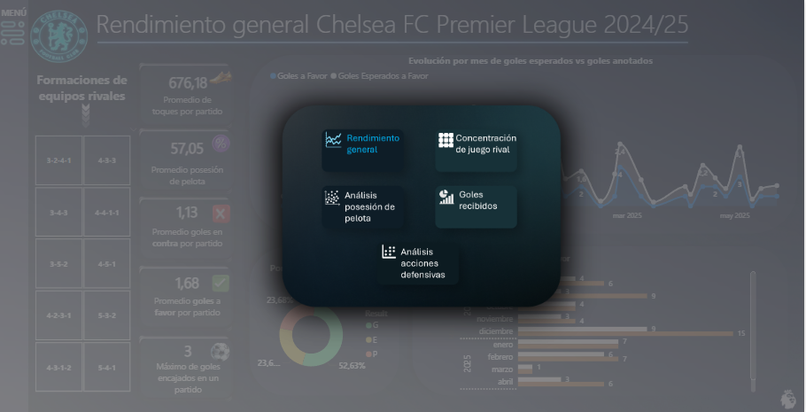
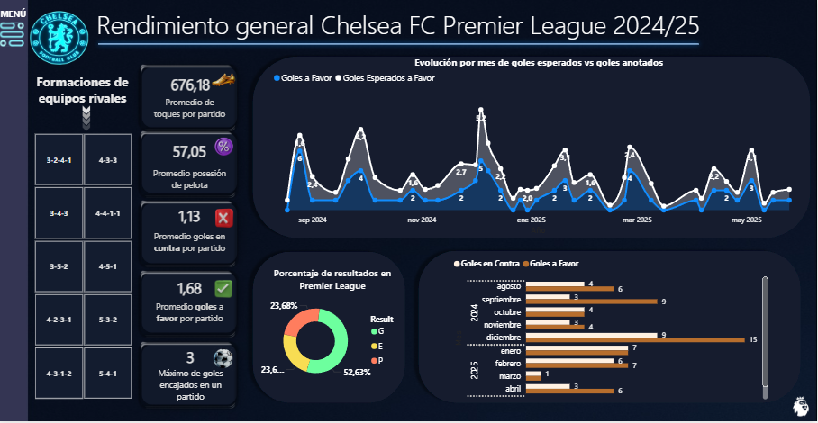
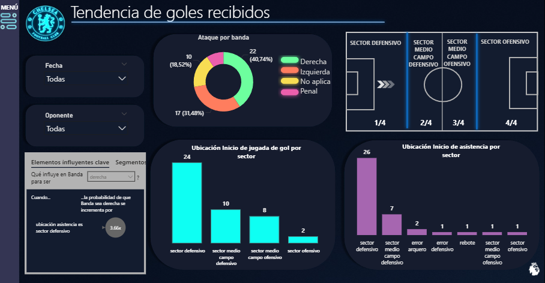
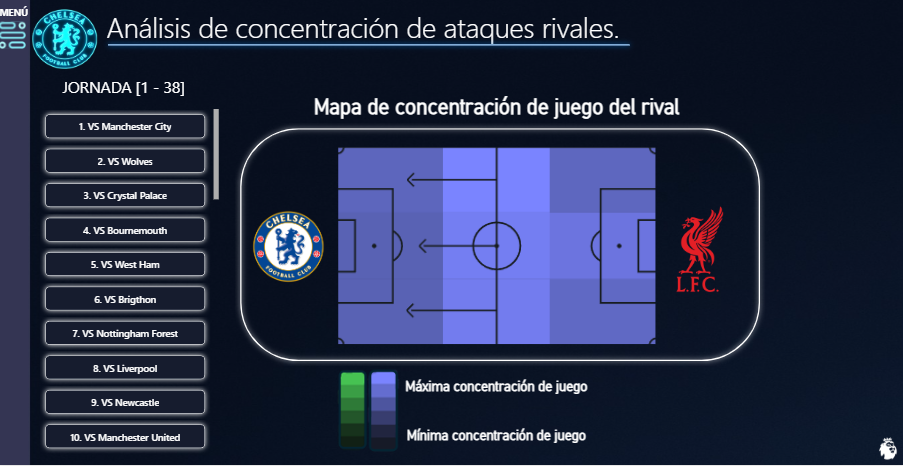
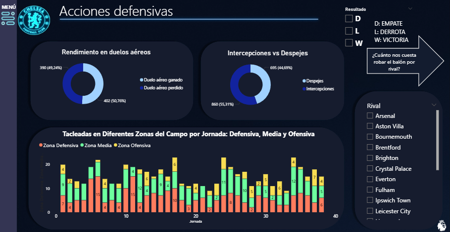
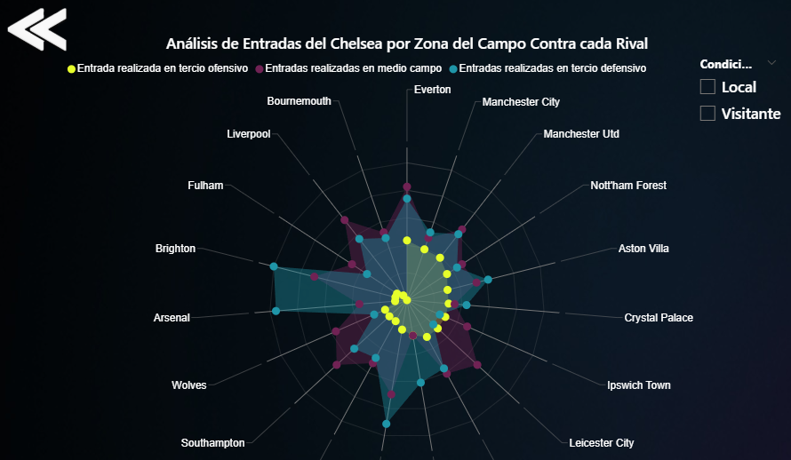
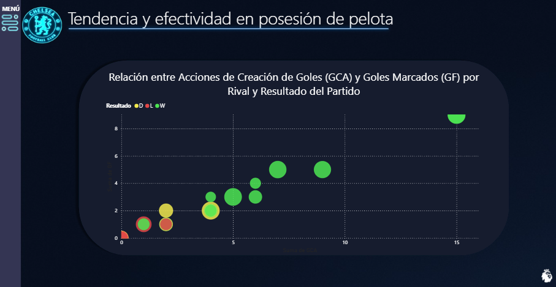

# Data-Analyst-CHELSEA-FC

Este proyecto analiza las debilidades del Chelsea FC en la Premier League 2024/25 mediante estadísticas clave como acciones ofensivas, defensivas, posesión de balón y goles marcados para mejorar su rendimiento. Se alinea con la ODS 8, buscando optimizar el desempeño y contribuir al crecimiento y éxito sostenido en el deporte.

Menú de navegación interactivo del dashboard:

Pantalla 1: estadisticicas generales por mes y filtrado por alinación rival

Pantalla 2: clasificación por banda y sector de cancha los goles recibidos e inicio de jugada por gol

Pantalla 3:Mapa de concentración de juego por cada rival

Pantalla 4:Desempeño defensivo por cada sector de cancha, segun despeje y juego aereo

Pantalla 4: Tackles del Chelsea en cada cada sector de cancha(3) por rival, filtrado de local y visitante

Pantalla 5 :Relación entre Acciones de Creación de Goles (GCA) y Goles Marcados (GF) por Rival y Resultado del Partido

